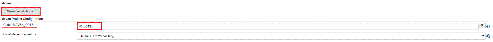

## OutOfMemory

> Maven build 시 FindBug Plugin을 함께 build 하면 OutofMemory 발생하는 문제.

### 문제 확인

- 기존 Maven Build Goals (문제 없음)

- Maven Goals 에 pmd, findbugs Build 추가 (OutOfMemory 발생)

- Build 중인 console 창 확인  

- OutOfMemory 발생  
  

### 해결

#### Jenkins 서버를 실행할 때 JVM 옵션의 Memory 할당 값 변경

- start.bat 파일 변경  

- JAVA_OPTS 값 변경  

#### Jenkins 에서 Maven 빌드시 Maven_OPTS 메모리 값 할당

- Jenkins 관리에서 시스템 설정 확인  

- 시스템 설정에서 Maven 설정 부분 확인 (Maven Installations... 클릭)

- Global MAVEN_OPTS 에 Maven 빌드 시 메모리 값 설정  

**문제 해결 완료**
