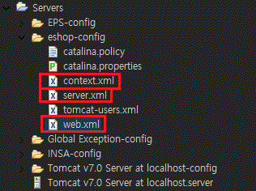
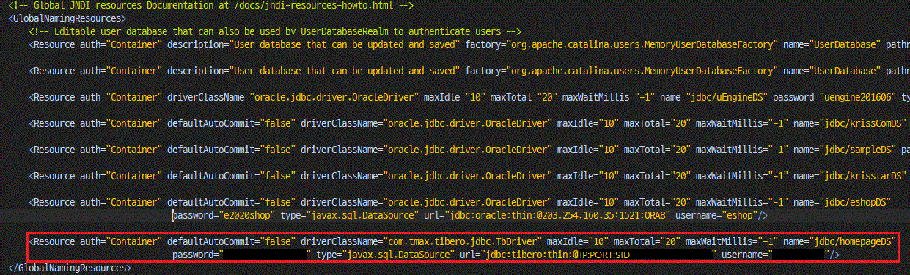
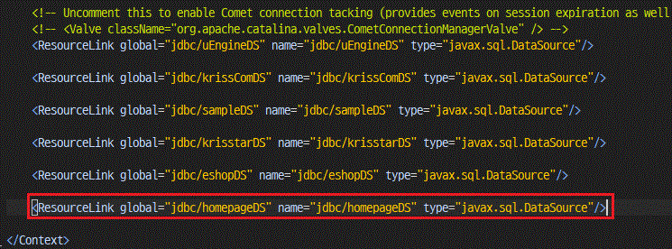
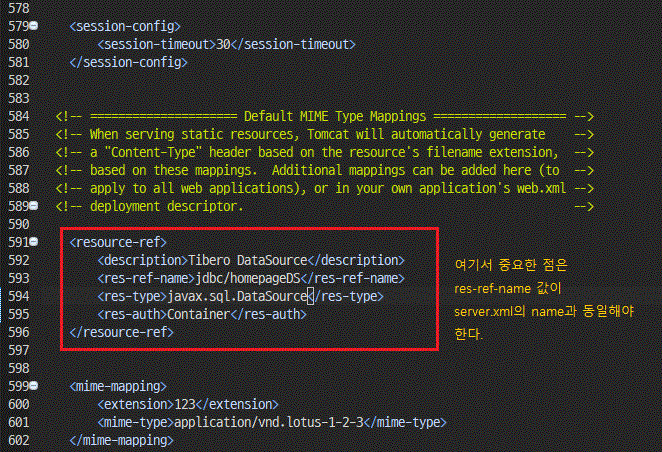

### 서버폴더파일목록
  

tomcat 서버 파일 수정
 - server.xml
 - context.xml
 - web.xml

### server.xml

`GlobalNamingResources` 태그안에  
`Resource` 추가  

~~~xml
<Resource auth="Container" defaultAutoCommit="false" driverClassName="com.tmax.tibero.jdbc.TbDriver"
            maxIdle="10" maxTotal="20" maxWaitMillis="-1" name="jdbc/homepageDS" password="password"
            type="javax.sql.DataSource" url="jdbc:tibero:thin:@ip:port:sid" username="username"/>
~~~

  

### context.xml
  

### web.xml
  

