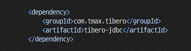

## tibero DB tomcat 서버 설정

### 톰캣서버폴더 파일목록
  

- tomcat 서버 파일 수정
  - server.xml
  - context.xml
  - web.xml
- pom.xml 라이브러리 의존성 추가

### server.xml

 - `<GlobalNamingResources>` 태그안에 `<Resource>` 추가  

~~~xml
<Resource auth="Container" defaultAutoCommit="false" driverClassName="com.tmax.tibero.jdbc.TbDriver"
            maxIdle="10" maxTotal="20" maxWaitMillis="-1" name="jdbc/homepageDS" password="password"
            type="javax.sql.DataSource" url="jdbc:tibero:thin:@ip:port:sid" username="username"/>
~~~

  

### context.xml

 - `<ResourceLink>` 추가  
~~~xml
<ResourceLink global="jdbc/homepageDS" name="jdbc/homepageDS" type="javax.sql.DataSource"/>
~~~

  

### web.xml

- `<resource-ref>` 추가  

~~~xml
<resource-ref>
  <description>Tibero DataSource</description>
  <res-ref-name>jdbc/homepageDS</res-ref-name>
  <res-type>javax.sql.DataSource</res-type>
  <res-auth>Container</res-auth>
</resource-ref>
~~~

  

### pom.xml 라이브러리 의존성 추가

~~~xml
<dependency>
  <groupId>com.tmax.tibero</groupId>
  <artifactId>tibero-jdbc</artifactId>
</dependency>
~~~

  
