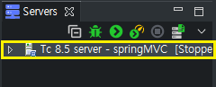
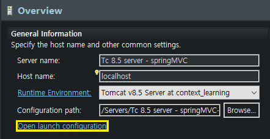
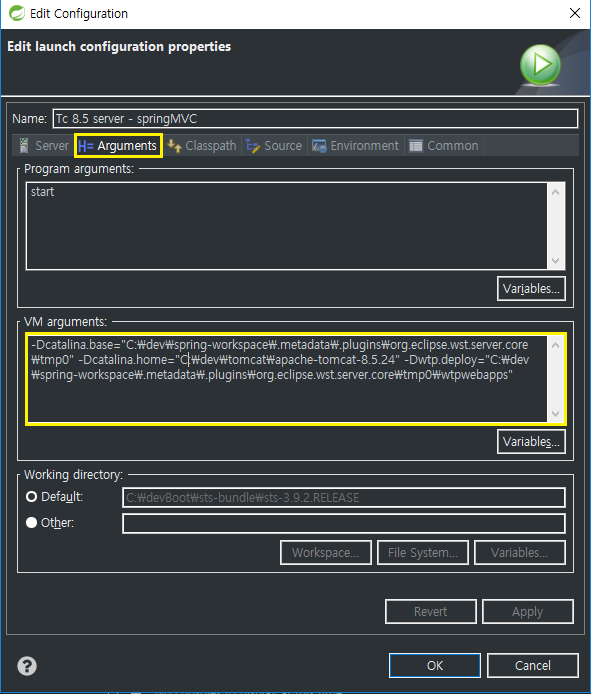
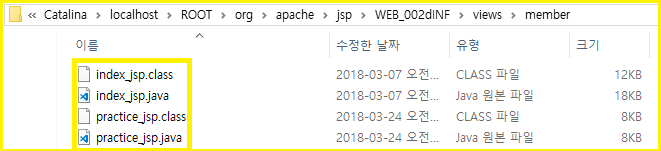

## JSP 컴파일 위치

1. `TomcatServer`를 더블클릭한다.  
  
  
2. `Open launch configuration` 를 클릭한다.  
  
  
3. `Arguments` 탭을 클릭하고 `VM arguments:` 를 확인한다.

~~~
-Dcatalina.base="C:\dev\spring-workspace\.metadata\.plugins\org.eclipse.wst.server.core\tmp0" 
~~~
`Dcatalina.base` 경로 아래에  
`\work\Catalina\localhost\` 경로에 컴파일 된다.  

