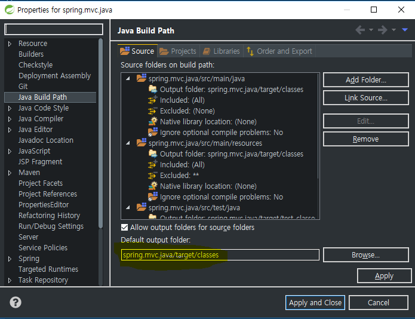
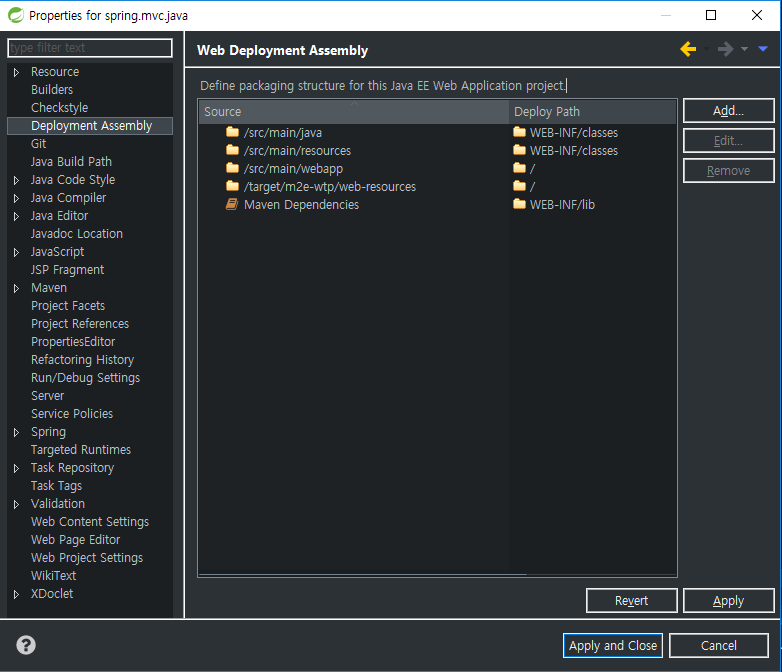
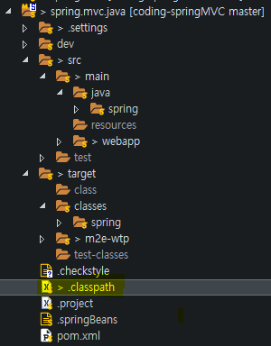
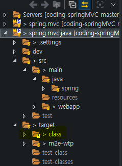

# build

 ->
 -> 

---
* **compile**   
소스의 문법을 분석해 기계어로 번역  
* **build**  
번역된 것과 그와 잡다한걸 모아서 실행 가능한 파일로 만듬.

* **java**  
사람이 작성한 source code 파일.
* **class**  
java 파일을 컴파일러를 통해 byte code로 변환한 파일.

> 컴파일 하게되면 클래스 파일이 생성 된다.

#### java파일과 class파일의 분리

##### 이클립스 기능
* **Build Project**  
프로젝트 안에 있는 파일들을 빌드한다.
* **clean...**  
컴파일된 파일들을 모두 삭제하고 다시 컴파일 하고 빌드한다.

> 실제로 컴파일되는 폴더를 열어보고 `clean..` 을 실행하면  
> 순간적으로 class 파일들이 모두 사라지고 다시 생성되는  
> 모습을 볼 수 있다.  

##### 클래스 파일 위치 설정방법

해당 프로젝트를 우클릭 해서 `Properties` 를 클릭한다.  

`Java Build Path` 
`Source` 탭의 `Default output folder` 를 수정한다.

`Deployment Assembly` 에서 `Deploy Path`를 수정한다.

그리고서 `project clean..`을 실행
원래의 `WEB-INF/classes` 폴더에 클래스 파일들이 생성된다.  

그래서 프로젝트내에 있는 `.classpath` 파일을 직접 수정.  
`target/classess` 에서 `target/class` 로 변경했다.  

 -> 
---
컴파일된 클래스파일의 경로가 변경된 걸 확인할 수 있다.

