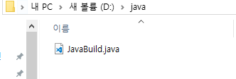

# build

---

---

---
* **compile**   
소스의 문법을 분석해 기계어로 번역  
* **build**  
번역된 것과 그와 잡다한걸 모아서 실행 가능한 파일로 만듬.

* **java**  
사람이 작성한 source code 파일.
* **class**  
java 파일을 컴파일러를 통해 byte code로 변환한 파일.

> 컴파일 하게되면 클래스 파일이 생성 된다.

#### java파일과 class파일의 분리

##### 이클립스 기능
* **Build Project**  
프로젝트 안에 있는 파일들을 빌드한다.
* **clean...**  
컴파일된 파일들을 모두 삭제하고 다시 컴파일 하고 빌드한다.

> 실제로 컴파일되는 폴더를 열어보고 clean.. 을 실행하면  
> 순간적으로 class 파일들이 모두 사라지고 다시 생성되는  
> 모습을 볼 수 있다.  

