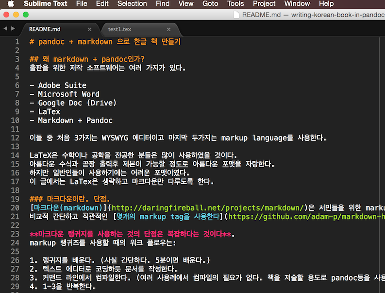

출처 : [[pandoc 설치]](https://github.com/jaimyoung/data-science-in-korean/blob/master/writing-korean-books-in-r-markdown.md)  

[[latex 설치]](https://miktex.org/download)  


# pandoc + markdown 으로 한글 책 만들기

## 왜 markdown + pandoc인가?
출판을 위한 저작 소프트웨어는 여러 가지가 있다.

- Adobe Suite
- Microsoft Word
- Google Doc (Drive)
- LaTex
- Markdown + Pandoc

이들 중 처음 3가지는 WYSWYG 에디터이고 마지막 두가지는 markup language를 사용한다.

LaTeX은 수학이나 공학을 전공한 분들은 많이 사용하였을 것이다. 
아름다운 수식과 곧장 출력후 제본이 가능할 정도로 아름다운 포맷을 자랑한다.
하지만 일반인들이 사용하기에는 어려운 포맷이였다. 
이 글에서는 LaTex은 생략하고 마크다운만 다루도록 한다.

### 마크다운이란
[마크다운(markdown)](http://daringfireball.net/projects/markdown/)은 서민들을 위한 markup 이다.
비교적 간단하고 직관적인 [몇개의 markup tag을 사용한다](https://github.com/adam-p/markdown-here/wiki/Markdown-Cheatsheet).

마크다운 랭귀지를 사용하는 것의 단점은 **워크플로우가 복잡하다는 것이다**:

1. 텍스트 에디터로 코딩하듯 문서를 작성한다.
1. 커맨드 라인에서 컴파일한다. 
1. 결과를 살펴본다. 
1. 1-3을 반복한다.

그러면 이런 귀챦은 워크플로우를 감수할 이유는 무엇이 있을까?
장점을 들자면:

1. 배우기 쉽다. (html이나 LaTeX에 비해서)
1. 읽기 쉽다. 여러 에디터가 컬러 코딩을 지원하고 (예: [Sublime](http://www.sublimetext.com/)
[markdown extension package](https://github.com/jonschlinkert/sublime-markdown-extended)), 
[브라우저 extension](https://github.com/volca/markdown-preview)도 존재한다.
    - 따라서 많은 경우 컴파일의 필요는 없다.
1. 소스를 버전 컨트롤 할 수있다. 소스가 그냥 텍스트 (plain text) 이므로.
    1. 사실 이것은 어마어마한 장점이다. 버전 컨트롤이 가능하다는 것은 협업과 공유가 쉽다는 것이기 때문이다.
1. 한번 작성하면 다양한 포맷으로 아웃풋이 지원된다. 여기서 pandoc이 중요해진다.
1. 인기가 좋다. 잘나가는 여러 플랫폼에서 지원한다. 
    1. Github 과 bitbucket은 자동으로 markdown을 웹페이지로 포맷해준다.
    1. [Oreilly 의 웹 저작 시스템 Atlas](https://atlas.oreilly.com/)도 마크다운을 지원한다.

마크다운은 이러한 장점들 때문에 여러 용도로 사용된다:

1. git 리포에 README / README.md 를 작성할 때. github이나 bitbucket에서는 자연스럽게.
1. R을 사용하는 사람은 Rmd ([R markdown](http://rmarkdown.rstudio.com/))라는 포맷으로 코드를 합쳐버린다. 재생 가능 연구의 최고봉이다.
1. 책을 저술할 때도! 마크다운으로 저술 후, pandoc 으로 컴파일한다.


## pandoc 작업 환경 설정

우선 좋은 에디터가 필요하다. markdown syntax highlighting 을 지원하는. 
본인은 sublime markdown extension package 를 사용한다.

그리고 latex을 설치해야 한다.
Mac OSX라면 https://tug.org/mactex/ 에서 거대한 (2.5GB) MacTeX를 다운로드 후 설치하는 것이 속편하다.
그러나 기본 latex은 한글 지원이 빈약하다. 
그러므로 <http://wiki.ktug.org/wiki/wiki.php/설치하기MacOSX/MacTeX>의
내용을 따라 한글지원 모듈과, 특히  나눔 nanum 폰트를 다운받자.
터미널에서 다음을 실행하면 된다.

    sudo tlmgr repository add http://ftp.ktug.org/KTUG/texlive/tlnet ktug
    sudo tlmgr pinning add ktug "*"
    sudo tlmgr install nanumttf hcr-lvt
    sudo tlmgr update --all --self

<http://wiki.ktug.org/wiki/wiki.php/MacOSX와XeLaTeX>도 참조하자. (본인은 아직 실행 안함)

마지막으로 pandoc 을 설치한다. <http://pandoc.org/>

## markdown + pandoc 워크 플로우 시험
시험해보기 위해서는 설치 완료 후 [pandoc의 튜토리얼을](http://pandoc.org/getting-started.html) 따라하면 된다. 

한글 버전이 필요하다면 이 document 를 사용해도 된다. 
다음 예제는 여러분이 보는 이 문서를 PDF 형식으로 생성해주는 것이다.
Bash shell에서:

```bash
cd ~
git clone git@github.com:Jaimyoung/writing-korean-book-in-pandoc.git 
cd writing-korean-book-in-pandoc
pandoc README.md -f markdown -t latex -s -o README.pdf --latex-engine=xelatex --variable mainfont='Nanum Myeongjo'
```

위에서 이야기한대로, sublime이 셋업된 상태이라면 README.md화일을 열었을 때 다음처럼 문서의 구조가
이미 한눈에 이해될 것이다.




어쨌건, 마지막 명령 `pandoc` 컴파일이 성공적으로 실행되면 디렉토리에 `README.pdf` 화일이 생성된다.
이 명령의 옵션을 좀 더 자세히 살펴보면:

- `-f` : "from" 소스 포맷. 
- `-t` : "to" 타겟 포맷.
- `-o` : "output" 화일 이름. `pdf` 확장자가 붙으면, latex 포맷으로 변환 후, pdflatex (혹은 xelatex)을 통해 pdf 화일이 생성된다.
- `-s` : "standalone" 한 화일로 모으기?
- `--latex-engine` : 디폴트인 pdflatex은 유니코드 / 한글 처리에 문제가 많다. 
    xelatex라는 엔진을 사용한다.
- `--variable` : 은 템플릿에 사용될 여러 변수를 커맨드 라인에서 설정해 준다.
    - 참조: http://pandoc.org/demo/example9/templates.html 에서처럼 `pandoc -D latex`을 실행하면 템플릿에 어떤 변수들이 지정되는지 알 수 있다.
    - 참조: http://pandoc.org/demos.html 을 보면 폰트와 다른 변수를 설정하는 부분이 나온다. 좋은 예이다:
    `pandoc -N --template=mytemplate.tex --variable mainfont=Georgia --variable sansfont=Arial --variable monofont="Bitstream Vera Sans Mono" --variable fontsize=12pt --variable version=1.14 README --latex-engine=xelatex --toc -o example14.pdf`
- `mainfont='Nanum Myeongjo'` : Mac OSX 에서 이 옵션을 넣어주지 않으면 생성된 pdf 화일에 한글이 보이지 않는다.
    - FontBook 을 실행하면 한글 폰트중 무엇이 설치되어있는지 알 수 있다.
    - `ApplyMyungjo`의 문제는 bold와 italic이 제공되지 않는 것이다.

즉, 아웃풋 포맷을 지정해주는데에 따라 한가지 소스로부터 여러 가지 다양한 "출판물"을 생성해낼수 있다.
(물론 여러가지 "소스 포맷"도 지원한다. 우리는 마크다운만 다루고 있지만...)
현재 지원되는 아웃풋 포맷은: 

- HTML 포맷: XHTML, HTML5, and HTML slide shows using Slidy, reveal.js, Slideous, S5, or DZSlides.
- 워드 프로세서 포맷: Microsoft Word docx, OpenOffice/LibreOffice ODT, OpenDocument XML
- 이북 포맷 Ebooks: EPUB version 2 or 3, FictionBook2
- 다큐먼테이션 포맷: DocBook, GNU TexInfo, Groff man pages, Haddock markup
- 출판 포맷: InDesign ICML
- TeX: LaTeX, ConTeXt, LaTeX Beamer slides
- PDF via LaTeX

... 등등이다. 

pandoc이 지원하는 쓸모있는 기능들:

- 목차 (table of contents)
    - `--toc` 혹은 `--table-of-contents` 옵션을 추가하면 된다.

    pandoc README.md -f markdown -t latex -s -o README.pdf --toc --latex-engine=xelatex --variable mainfont='Nanum Myeongjo'

- 인용 (citation): <http://rmarkdown.rstudio.com/authoring_bibliographies_and_citations.html>
- 주석 (footnote)
    - Pandoc markdown 은 `[^1] 주석입니다` 형식으로 넣어주면 된다[^1].
    줄이 길어지면 인덴트를 해주면 된다.
    http://pandoc.org/README.html#footnotes 를 참조하자.    
- 색인 (index): 확인바람

[^1] 주석입니다.


