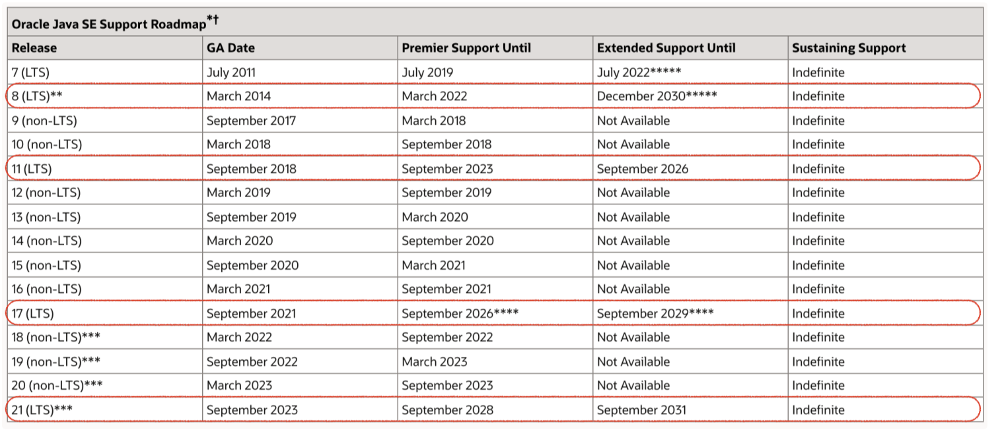
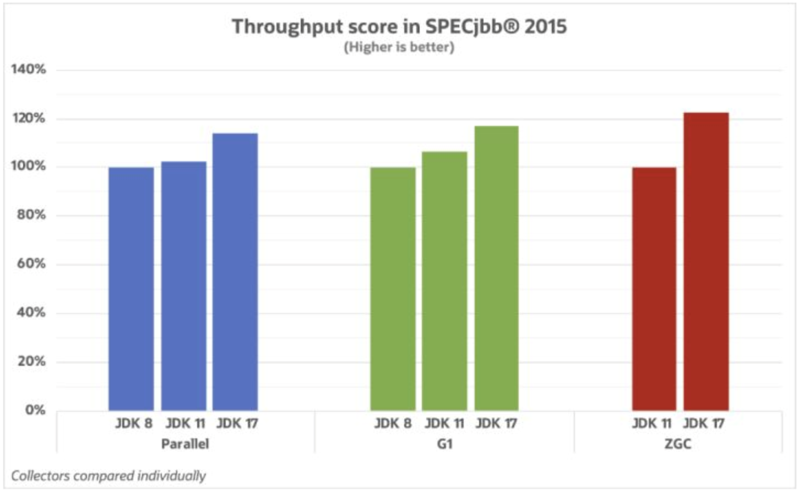

## 🧊 OpenJDK 버전 선택

- OpenJDK를 선택하기 위해서는, LTS(Long Term Support) 를 사용해야 합니다.LTS 버전은 추가 기능, 버그 수정, 보안 업데이트가 정기적으로 제공되며, 일반적으로 몇 년 간 지원되기 때문입니다.
- LTS 버전
  - OpenJDK8 - 22년
  - OpenJDK11 - 23년
  - OpenJDK17 - 26년
  - OpenJDK21 - 28년
 

- **Premier Support Until**  
일반적으로 제품 출시 후 초기 몇 년 동안 제공되는 기본 지원 서비스를 의미합니다
- **Extended Support UntilPremier Support**  
기간이 끝난 후 제공되는 추가 지원 옵션입니다일반적으로 추가 비용이 발생하며, 주로 기업이 마이그레이션할 시간을 벌기 위해 사용됩니다

## 🧊 OpenJDK17 을 선택한 이유 

- Gradle 빌드 문제 OpenJDK21을 선택하고자 했지만, BodyCodi Plus Project 개발 당시에 Gradle Build 지원이 OpenJDK 17까지만 지원 되었고, OpenJDK21에 대해서는 준비 중이었습니다.  
***현재 Gradle 8.5 버전에서는 Java21 프로젝트를 완전히 지원***
- SpringBoot3 최소 버전 SpringBoot3의 최소 OpenJDK 버전은 17.
- 추가된 기능 및 보안 패치
- 성능 개선

## 🧊 추가 및 개선된 Code

[Java Language Updates](https://docs.oracle.com/en/java/javase/17/language/index.html#Java-Platform%2C-Standard-Edition)

### Local Variable Type Inference
Java 8에서는 모든 로컬 변수에 명시적인 타입 선언이 필요했습니다.  
Java 10부터 도입된 var 키워드를 사용하면 로컬 변수의 타입 추론이 가능합니다.  

**before**
~~~java
List<String> list = new ArrayList<>();
Stream<String> stream = list.stream();
~~~

**after**  
~~~java
var list = new ArrayList<String>(); // ArrayList<String> 타입으로 추론됩니다.
var stream = list.stream(); // Stream<String> 타입으로 추론됩니다.
~~~
### HTTP Client API
Java 8에서는 HttpClient API가 존재하지 않았으므로, HttpURLConnection 또는 Apache HttpClient와 같은 외부 라이브러리를 사용했습니다.  
Java 11부터 도입된 HttpClient 를 사용해서 HTTP 요청을 보내고 응답을 받을 수 있습니다.  

**before**  
~~~java
URL url = new URL("http://example.com");
HttpURLConnection con = (HttpURLConnection) url.openConnection();
con.setRequestMethod("GET");

BufferedReader in = new BufferedReader(new InputStreamReader(con.getInputStream()));
String inputLine;
StringBuilder content = new StringBuilder();
while ((inputLine = in.readLine()) != null) {
    content.append(inputLine);
}
in.close();
con.disconnect();

System.out.println(content.toString());
~~~

**after**  
~~~java
HttpClient client = HttpClient.newHttpClient();
HttpRequest request = HttpRequest.newBuilder()
        .uri(URI.create("http://example.com"))
        .build();
HttpResponse<String> response = client.send(request, BodyHandlers.ofString());
System.out.println(response.body());
~~~
### Sealed Classes and Interfaces
sealed 클래스와 인터페이스는 해당 클래스를 상속하는 서브클래스의 종류를 제한합니다. 이를 통해 더 엄격한 타입 안정성을 제공합니다.

[Java Language Updates](https://docs.oracle.com/en/java/javase/17/language/sealed-classes-and-interfaces.html#GUID-0C709461-CC33-419A-82BF-61461336E65F) 

**new**  
~~~java
public sealed class Shape permits Circle, Square {
    // 클래스 정의...
}

final class Circle extends Shape {
    // 클래스 정의...
}

final class Square extends Shape {
    // 클래스 정의...
}
~~~
### Switch Expression
Java17 에서는 더 간결하고 명확한 문법을 제공합니다.  

**before**  
~~~java
String day = "MONDAY";
switch (day) {
    case "MONDAY":
        System.out.println("Weekday");
        break;
    case "FRIDAY":
        System.out.println("Weekday");
        break;
    case "SUNDAY":
        System.out.println("Weekend");
        break;
    default:
        System.out.println("Invalid day");
}
~~~
**after**  
~~~java
String day = "MONDAY";
String typeOfDay = switch (day) {
    case "MONDAY", "FRIDAY" -> "Weekday";
    case "SUNDAY" -> "Weekend";
    default -> "Invalid day";
};
System.out.println(typeOfDay);
~~~

### Pattern Matching  instanceof
Java17에서는 instanceof 와 함께 패턴 매칭을 사용하여 타입 캐스팅을 간소화할 수 있습니다.  

**before**
~~~java
Object obj = "Hello, World!";
if (obj instanceof String) {
    String s = (String) obj;
    System.out.println(s.toUpperCase());
}
~~~
**after**  
~~~java
Object obj = "Hello, World!";
if (obj instanceof String s) {
    System.out.println(s.toUpperCase());
}
~~~
### Record
일반 클래스보다 간단한 형식으로 일반 데이터 집계를 모델링하는 데 도움이 됩니다.  
적절한 접근자, 생성자, equals, hashCode및 toString메서드가 자동으로 생성됩니다.  

**before**  
~~~java
public final class Rectangle {
    private final double length;
    private final double width;

    public Rectangle(double length, double width) {
        this.length = length;
        this.width = width;
    }

    double length() { return this.length; }
    double width()  { return this.width; }

    // Implementation of equals() and hashCode(), which specify
    // that two record objects are equal if they
    // are of the same type and contain equal field values.
    public boolean equals...
    public int hashCode...

    // An implementation of toString() that returns a string
    // representation of all the record class's fields,
    // including their names.
    public String toString() {...}
}
~~~
**after**  
~~~java
record Rectangle(double length, double width) { }
~~~

### Text blocks
여러줄을  작성하기 위해서 기존에는 `\n` 을 사용해야 했지만, `“““` 를 사용해서 여러줄 코드를 작성할 수 있습니다.  

[Java SE Text Blocks Programmer's Guide](https://docs.oracle.com/en/java/javase/17/text-blocks/index.html)  

**before**  
~~~java
String json = "{\n" +
              "  \"name\": \"John\",\n" +
              "  \"age\": 30\n" +
              "}";
~~~
**after**  
~~~java
String json = """
              {
                "name": "John",
                "age": 30
              }""";
~~~

### NullPointerException
NullPointerException 발생 시 로그가 더욱 상세하고 명확해졌습니다.  
**before**  
~~~
java.lang.NullPointerException: null
~~~
**after**  
~~~java
Exception in thread "main" java.lang.NullPointerException:
Cannot assign field "i" because "a" is null
at Prog.main(Prog.java:5)
~~~
## 🧊 Garbage Collection

> **SPECjbb 2015**  
> 자바 서버 벤치마크 도구로, 자바 기반 서버의 성능을 측정하는 데 사용됩니다.  
> 자바 애플리케이션 서버와 백엔드 데이터베이스 시스템의 성능을 평가하기 위해 설계되었습니다.  

### Throughput Comparison(처리량 비교)
  

처리량 측면에서, Parallel에서는 JDK 8과 JDK 11 사이에 큰 차이가 없으며 JDK 17은 JDK 8보다 약 15% 더 높습니다.  
G1의 JDK 17은 JDK 8보다 18% 더 높습니다. ZGC는 JDK 11에 도입되었으며, JDK 17은 JDK 11에 비해 20% 이상 향상되었습니다.  

### Latency Comparison(지연시간 비교)
  

GC 대기 시간 측면에서 JDK 17의 개선이 뚜렷합니다.  
GC 일시 중지를 줄이려는 노력이 성과를 거두었으며 많은 개선 사항이 GC 개선으로 인한 것임을 알 수 있습니다.  

Parallel에서 JDK 17은 JDK 8 및 JDK 11에 비해 40% 향상되었습니다.  
G1에서 JDK 11은 JDK 8에 비해 26% 향상되었으며 JDK 17은 JDK 8에 비해 거의 60% 향상되었습니다.  
JDK 11과 비교하면 JDK ZGC의 17은 40% 이상 향상되었습니다.  

### Resource Usage(Resource 사용)
  

위 그림은 세 가지 수집기의 최대 기본 메모리 사용량을 비교합니다.  
이러한 관점에서 Parallel과 ZGC는 모두 안정적이므로 원시 수치를 살펴봐야 합니다.  
이 분야에서 G1이 개선되었음을 알 수 있는데, 이는 주로 모든 기능과 개선 사항으로 인해 메모리 세트 관리의 효율성이 향상되었기 때문입니다.

### GC 선택 기준
| GC | 작동 방식 | 주요 특징 | 적합한 시나리오 |
|:----------|:-----------|:------------|:------------|
| ParallelGC | Parallel GC는 멀티스레드 환경에서 효율적으로 작동하도록 설계된 GC입니다. 가비지 컬렉션 동안 모든 애플리케이션 스레드가 중단됩니다. | Parallel GC는 처리량(Throughput)에 중점을 둡니다. 이는 애플리케이션 실행 시간 대비 가비지 컬렉션에 소요되는 시간의 비율을 최소화하는 것을 목표로 합니다. | 배치 처리 등 처리량이 중요한 애플리케이션에 적합합니다. 응답 시간보다 전체 실행 시간의 최소화가 중요한 경우에 주로 사용됩니다. |
| G1 GC (Garbage-First Garbage Collector) | G1 GC는 힙을 여러 개의 영역(Region)으로 나누고, 가장 쓰레기가 많은 영역부터 우선적으로 처리합니다. 이는 효율적인 가비지 컬렉션을 가능하게 하며, 큰 힙 크기에도 잘 작동합니다. | G1 GC는 빈번하지만 짧은 GC 중단 시간(Stop-the-World)을 목표로 합니다. 이를 통해 상대적으로 높은 처리량과 낮은 지연 시간을 달성할 수 있습니다. | 대형 힙 크기와 긴 응답 시간 요구 사항을 가진 애플리케이션에 적합합니다. 웹 서버 또는 백엔드 시스템과 같이 빠른 응답 시간이 중요한 애플리케이션에서 유용합니다. |
| ZGC (Z Garbage Collector) | ZGC는 대규모 힙과 낮은 지연 시간을 목표로 하는 스케일러블한 GC입니다. ZGC는 가비지 컬렉션 중에도 애플리케이션 스레드를 대부분 실행 상태로 유지합니다. | ZGC는 매우 낮은 중단 시간을 제공하며, 힙 크기가 수십 TB에 이르는 대규모 시스템에서도 효과적으로 작동합니다. | 실시간 시스템, 대화형 애플리케이션, 대규모 메모리를 필요로 하는 애플리케이션에서 유용합니다. 지연 시간을 최소화하면서 큰 메모리를 관리해야 하는 경우에 적합합니다 |

- **응답 시간 대 처리량**: 응답 시간이 중요하면 G1 또는 ZGC를 고려합니다. 처리량이 중요하면 Parallel GC를 고려합니다.
- **힙 크기**: 큰 힙 크기를 관리해야 하는 경우 G1 또는 ZGC가 더 적합할 수 있습니다.
- **애플리케이션 유형**: 인터랙티브한 애플리케이션은 ZGC와 같은 낮은 지연 시간 GC를 선호할 수 있으며, 배치 처리와 같은 작업은 Parallel GC로 더 효율적일 수 있습니다.
- **하드웨어 리소스**: 멀티 코어 시스템의 경우 Parallel GC와 G1이 잘 맞을 수 있으며, 대규모 메모리를 효율적으로 관리해야 하는 경우 ZGC를 고려할 수 있습니다.

### Summary
어떤 GC를 사용하든 JDK 17의 전반적인 성능은 이전 버전에 비해 향상되었습니다.  
JDK 8에서는 Parallel이 기본 설정이었으나 JDK 9에서는 G1으로 변경되었다.  

이후 G1이 Parallel보다 빠르게 개선되었지만 어떤 경우에는 여전히 Parallel이 최선의 선택일 수 있다.  
ZGC(JDK 15에서 공식적으로 사용)의 추가는 세 번째 고성능 대안이 되었습니다.  

## 🧊 느꼈던 점과 앞으로..
사실, 아직 사용량이 많지 않아, GC의 성능개선이 몸소 느껴지진 않지만,  
코드를 작성할 때, 코드의 가독성 및 생산성이 많이 높아진 걸 느낄 수 있었습니다.  
  
OpenJDK17을 사용한 이유가 SpringBoot3(SpringFramework6)를 사용하기 위한 목적도 있었지만,  
SpringBoot2를 사용해서 이미 많은 라이브러리를 사용하고 있었고, SpringBoot3 로의 마이그레이션 작업이  
생각보다 오래 걸려, OpenJDK17 사용에 만족해야 했습니다.  
  
아주 특수한 상황이 아니고서야, 버전을 다운그레이드하는 경우는 없었던 것 같습니다.  
전부 숙지하기는 어렵지만, 수많은 신규 기능, 및 기능 개선 그리고 수많은 보안 패치가 이루어진 신규 버전을 사용하는 것은 관리 및 유지보수상의 문제, 개발 생산성의 문제만 없다면 당연히 해야하는 일이라고 생각 됩니다.  
  
다음 신규 프로젝트에는, OpenJDK21 버전과 SpringBoot3(SpringFramework6)를 사용해서 프로젝트를 진행하면 좋을 것 같네요!  
