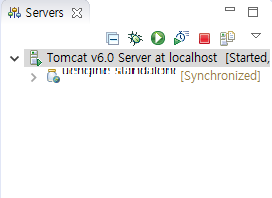

~~~xml

<context:property-placeholder location="classpath:org/uengine/uengine_#{ systemProperties['SYSTYPE']}.properties" />
~~~

  
  
  

>`#{ systemProperties['SYSTYPE']} ` 이렇게 스프링 SPEL 을 사용하려면  
TOMCAT에서 설정한다.  

